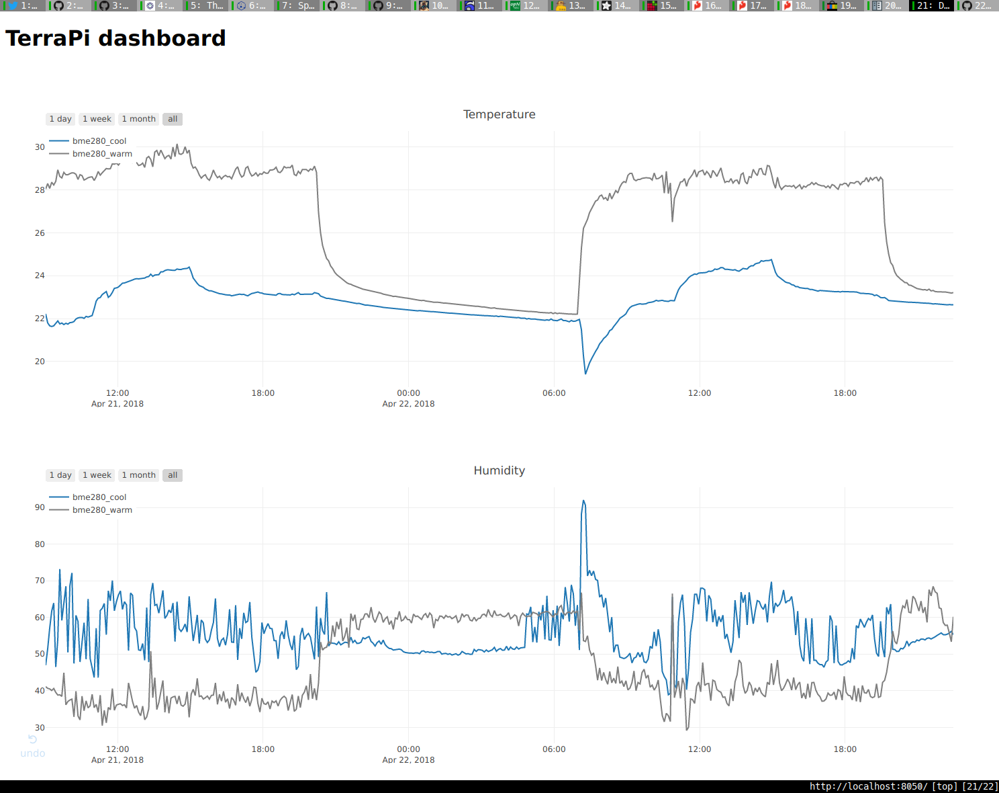

TerraPi
====

Introduction
----

TerraPi is a simple program that collects data from various sensors, and is able
to control devices based on measurements. I wrote it to monitor and control
heat, light and humidity in my pancake tortoises enclosure with a Raspberry Pi
Zero.


My initial goal was to to create something that is

* a simple daemon without a hardwired GUI or web interface.
* configurable from a text file. 
* easily extendable with new sensors, etc.

**WARNING**: *Please note that this is by no means "production ready"! I am using it to
control my enclosure, but it's still experimental. There is no proper error
handling, no config validation, no installer, etc.

Architecture
----

The core of the program is a scheduler that fires up each *Sensor Device* at
configurable periods. Measurements from these devices are stored in a database.
This is all handled by the `SensorDevice` abtract class, so *Sensor Device*
implementations only need to subclass it, and override the `_measure` abstract
method.

It is important that one *Sensor Device* can have multiple sensors. For
example, the BME280 is a temperature, humidity and barometric pressure sensor in
one chip. These sensors are handled individually in the database (e.g. for each
configured BME280 device there will be 3 sensors in the database).

*Sensor Devices* have a list of callbacks, so *Controlled Devices* can
register themselves to get notified of measurements. For example, a thermostat
device can register itself to a temperature sensor, and receive the temperature
in its callback function every time the sensor is read.

Installation
----

TerraPi is a Python program so you are going to need Python, obviously. I wrote
it for Python 3, and I have no idea if it works 2. There is no installer yet,
the following dependencies have to be installed manually:

* SQLAlchemy
* APScheduler
* pytz
* tzlocal
* PyYAML
* Adafruit_DHT
* RPi.GPIO
* smbus

You will also need to install a database server supported by SQLAlchemy, and
create a user and database for TerraPi. I'm using PostgreSQL:

```
[0x00 terrapi]$ su pgsql
[0x00 ~]$ createdb terrapidb
[0x00 ~]$ createuser terrapiusr
[0x00 ~]$ psql terrapidb
psql (9.5.12)
Type "help" for help.

terrapidb=# alter user terrapiusr with encrypted password 'terrapi';
ALTER ROLE
testdb=# grant all privileges on database terrapidb to terrapiusr;
GRANT
testdb=#
```

After dependencies are installed, and the database is running, you can just
clone this repo, edit the config file, and start the program:

```
pi@raspberrypi:~ $ git clone https://github.com/sghctoma/terrapi
pi@raspberrypi:~ $ vim config.yaml # see the next section on configuration
pi@raspberrypi:~ $ cd terrapi
pi@raspberrypi:~ $ ./terrapi.py
```

Configuration
----

Configuration is done in a YAML file (*config.yaml* by default) that has three
main sections:

* global: Settings used by multiple devices go here. Currently only the database
  connection string is in the global scope.
* `sensor_devices`: A list of *Sensor Device* configurations
* `controlled_devices`: A list of *Controlled Device* configurations

I have added my config file to the repo, so you can 

The following tables describe the settings for all available devices. Settings
in **`bold`** are required, the `others` are optional.

### Global settings

Setting | Description
--- | ---
**`connection_string`** | Database connection string. The program uses SQLAlchemy, so in theory it is compatible with a wide range of databases. It has been tested only with PostgreSQL though.

### Device common settings

Setting | Description
--- | ---
**`type`** | The device type in the format `module.class` relative to the `devices` package. E.g. `dht.DHT22` for the DHT22 sensor device.
**`name`** | An arbitrary, but unique name.
`description` | A short description that is stored in the database along with the name and type of the sensor.

### Sensor Device common settings

Setting | Description
--- | ---
`schedule` | It's either a number, or a cron-style schedule specification. In case it's a number, it is interpreted as a period in minutes, and in case of a cron-style schedule specification, please refer to `man 5 crontab`. Jobs are automatically added to the scheduler, device module writers do not need to bother with it (they just need to subclass `SensorDevice`).<br />Default is a 5 minute period.

### Controlled Device common settings

Setting | Description
--- | ---
**`controller`** | What kind of *Controller Device* to use. Currently only the `controller.GPIOSwitch` is implemented, which simply uses a GPIO to control a device (probably through a relay).

### Device-specific settings

#### bme280.BME280

[BME280](https://www.bosch-sensortec.com/bst/products/all_products/bme280) is a
temperature, humidity and barometric pressure sensor. It supports both SPI and
I2C interfaces, but TerraPi currently supports only I2C (SPI is used for the
MPC3008 ADC).


Setting | Description
--- | ---
`address` | The I2C address of the BME280 sensor. The chip can be configured to use 0x77 instead of the default 0x76. This means that only two of these devices can be used on one I2C bus!<br />The default is 0x76.

#### dht.DHT11, dht.DHT22, dht.AMR2302

[DHT11, DHT22, and AMR2302](https://cdn-learn.adafruit.com/downloads/pdf/dht.pdf)
are temperature and humidity sensors. These devices use one GPIO to communicate.

Setting | Description
--- | ---
**`gpio_pin`** | The BCM number of the GPIO pin used to communicate with the device.

#### controller.GPIOSwitch

This device uses one GPIO to control some other devicea via a relay board like this:


Setting | Description
--- | ---
**`gpio_pin`** | The BCM number of the GPIO pin used to communicate with the device.
`reversed` | `True` if the device is off when GPIO is high, `False` otherwise.<br />The default is `True`.

#### light.Lightswitch

This *Controlled Device* is used to switch lights on and off, but can be used
for anything that needs an on and off schedule. I control a modified ZooMed
UVB/LED Terrarium Hood with this.


Setting | Description
--- | ---
**`off_schedule`** | Typically this will be a cron-style schedule specification for when the lights turn off. You can also give an integer, which will be interpreted as a period in minutes.
**`on_schedule`** | Typically this will be a cron-style schedule specification for when the lights turn on. You can also give an integer, which will be interpreted as a period in minutes.

#### `thermostat.Thermostat`

This *Controlled Device* acts as a thermostat (switches things on and off based
on temperature.

Setting | Description
--- | ---
**`sensor`** | The `name` of the temperature sensor you want to use.
**`temperatures`** | A list of `time` and `temperature` pairs, so you can specify acceptable temperature ranges for time ranges. Time ranges can be open-ended, so for example the following means temperature should be between 28 and 30 Celsius from 12:00 to 20:00, and between 20 and 25 Celsius in the remaining time:<br />`temperatures:`<br />&nbsp;`-time: "-12"`<br />&nbsp;&nbsp;`temperature: 28-30`<br />&nbsp;`-time: "20-"`<br />&nbsp;&nbsp;`temperature: "20-25"`

Dashboard
----

The dashboard.py script generates interactive graphs from measurements. You will
need to [install Dash](https://dash.plot.ly/installation) to use it.



This script is completely decoupled from the TerraPi daemon, it just uses the
same database. The databse connection string is read from the config.yaml file.

Todo
----

There are a lot of things I want to do with this tool. Just to name a few:

* First, and foremost config validation, logging and error handling.
* I would like to store device state switches, so that I know when a controlled
  device is on and off. This could be useful for e.g. a thermostat.
* I plan to add support for Energenie power  switches.
* *Controller Devices* probably should get their own main section in the future,
  so that multiple *Controlled Devices* can use the same controller.
